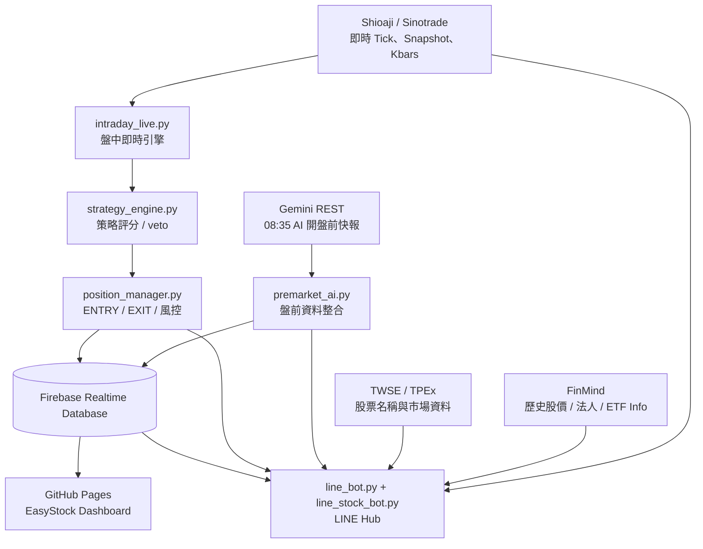
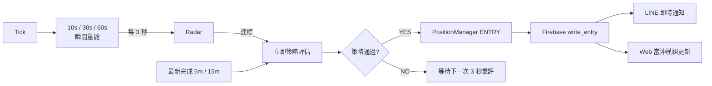
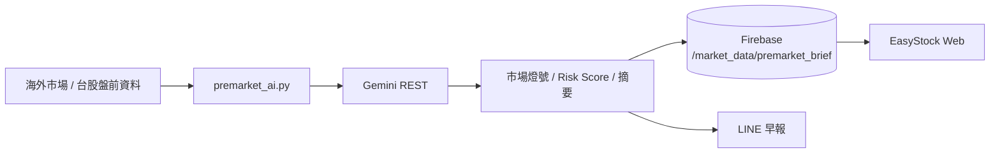

# EasyStock｜墨衡量化

> 台股即時監控、秒級瞬間爆量雷達、當沖訊號追蹤、AI 早報、Firebase Web Dashboard 與 LINE Bot 的整合式量化研究系統。  
> **By JimmyWei**

🌐 Web Dashboard：<https://jimmyeyes03160729.github.io/easystock/>

---

## 專案定位

EasyStock 的核心不是「自動下單機器人」，而是一套把 **即時行情 → 策略判斷 → 訊號追蹤 → Web 顯示 → LINE 通知** 串在一起的台股盤中監控系統。

目前正式設計仍以 **模擬訊號 / 追蹤** 為主：

- 不會自動送出真實券商委託。
- 當沖 ENTRY / EXIT 由策略引擎產生後，同步寫入 Firebase。
- Web 當沖模組直接讀 Firebase。
- 同一個 ENTRY / EXIT 事件會接著推送到 LINE。
- LINE 查詢 Bot 同時提供個股、ETF、大盤、K 線、法人、早報與當沖狀態查詢。

---

## 系統架構



---

## 核心模組

| 模組 | 功能 | 原理 |
|---|---|---|
| `premarket_ai.py` | 08:35 AI 早報 | 收集海外市場與台股盤前資料，交由 Gemini REST 產生摘要，再寫入 Firebase 並推 LINE |
| `intraday_live.py` | 即時盤中引擎 | 接收 Shioaji Tick、建立活動股票池、計算瞬間量能、觸發策略 |
| `strategy_engine.py` | 當沖策略 | 綜合 VWAP、5m/15m 趨勢、K 棒結構、量價與市場燈號計分 |
| `position_manager.py` | 部位追蹤 | 管理 ENTRY、停損、停利、Trailing、技術出場與 12:55 強制 EXIT |
| `firebase_store.py` | 資料交換層 | 將盤前、雷達、ENTRY、EXIT、部位狀態寫入 Firebase |
| `line_bot.py` | LINE 統一推送介面 | 讓盤前早報、當沖訊號與其他 LINE push 共用同一組介面 |
| `line_stock_bot.py` | LINE Webhook | 接收 LINE 指令、驗證 callback、回覆文字 / Flex 圖卡 |
| `stock_command_service.py` | LINE 指令與資料層 | 解析股票 / ETF / 大盤指令並整合 Shioaji、FinMind、TWSE / TPEx |
| `line_card_renderer.py` | LINE 圖卡 | 產生即時、K 線、法人圖；採台股紅漲綠跌 |
| GitHub Pages | Web Dashboard | 從 Firebase 顯示盤前資料與盤中當沖模組 |

---

# 當沖模組原理

## 1. 即時行情

盤中資料來源以 **Shioaji / Sinotrade** 為主。

不是每幾秒重新下載整個市場，而是：

```text
Shioaji 即時 Tick
        ↓
本機 rolling windows
        ↓
10s / 30s / 60s 瞬間量能
        ↓
活動股票池 / Radar
```

Tick 本身是即時事件推送。

---

## 2. 活動股票池與瞬間爆量 Radar

目前盤中節奏：

| 項目 | 頻率 |
|---|---:|
| Shioaji Tick | 即時 |
| Main Loop | 0.5 秒 |
| 瞬間爆量 Radar | **3 秒** |
| Instant ENTRY 重評 | **3 秒** |
| Universe 候選池更新 | 60 秒 |
| Firebase 部位價格更新 | 約 5 秒 |
| 停損 / 停利 / Trailing | Tick 級 |

V5.1 的重要改動是：

> **瞬間爆量一旦被 Radar 發現，不再等待下一根 5 分 K 收完。**

新流程：



因此「爆量發現 → 開始策略判斷」通常是 **0～3 秒級**。

實際 LINE 抵達時間還會受到策略運算、Firebase 與 LINE API 網路延遲影響，但已不再有等待 5 分 K 收線造成的數分鐘延遲。

---

## 3. 5 分 / 15 分 K 的角色

秒級 ENTRY 並不是取消 K 線。

5m / 15m 改成：

- 趨勢背景
- VWAP / 技術確認
- K 棒結構判斷
- 策略 veto / 風控依據

也就是：

```text
瞬間爆量 = 觸發器
5m / 15m = 品質確認與風控背景
```

---

## 4. 策略進場條件

目前策略以分數制搭配 veto 機制。

基本要求：

```text
Score >= 76
AND
至少 2 個有效理由
AND
沒有任何 veto
```

主要 veto 包含：

- 價格低於 VWAP
- 價格高於 VWAP 過多（約 > 3%）
- 上影線風險
- 5 分 K 短線低點跌破
- 市場燈號為 RED

這種設計的目的，是避免「只有爆量」就直接追價。

---

## 5. ENTRY 與 Web / LINE 的連動

當策略正式產生 ENTRY：

```text
PositionManager open_position
        ↓
Firebase write_entry
        ├──→ GitHub Pages 當沖模組
        ↓
LINE push
```

EXIT 同樣：

```text
PositionManager EXIT
        ↓
Firebase write_exit
        ├──→ Web 更新
        ↓
LINE EXIT 通知
```

因此 **Web 與 LINE 不是兩套訊號**，而是同一個 ENTRY / EXIT 事件的兩個輸出端。

---

# 當沖時間規則

所有時間採 **Asia/Taipei（UTC+8）**。

| 時間 | 行為 |
|---|---|
| 08:35 | AI 開盤前市場快報 |
| 08:50 | 盤中服務排程啟動 |
| 09:00 | Universe / 瞬間爆量 Radar 開始 |
| 09:30 | 開始允許 ENTRY |
| 12:30 | 停止新的 ENTRY |
| 12:55 | 強制結束仍在追蹤的部位 |
| 13:00 | 當日盤中服務完全結束 |

每日 ENTRY 硬限制：

```text
MAX 3 symbols / day
```

VM 重啟後仍應從 Firebase 延續當日計數，避免重啟造成超額訊號。

---

# 風控與 EXIT

持倉建立後，EXIT 不需要等待 3 秒 Radar 或 5 分 K。

風控以即時 Tick 為主，可包含：

- Stop Loss
- Take Profit
- Trailing Stop
- 技術條件失效
- 12:55 Force Exit

目標是讓「找進場」與「持倉風控」使用不同節奏：

```text
找機會：3 秒 Radar
做確認：最新 5m / 15m
管風險：Tick 級
```

---

# 08:35 AI 開盤前快報

`premarket_ai.py` 由 systemd timer 於台灣時間 **08:35** 執行。

流程：



Firebase 路徑：

```text
/market_data/premarket_brief
```

LINE 也可輸入：

```text
早報
早上快報
```

直接查看目前 Firebase 最新快報。

---

# LINE Hub

LINE Bot 不只是查股工具，也整合自動通知與系統狀態。

## 快速查價

```text
2330
#2330
#台積電
台積電股價
```

ETF 可直接輸入：

```text
0050
00878
006208
00980A
```

`00878` 不再被限制為「4 碼股票」。

---

## 即時走勢 `P`

```text
P台積電
P2330
P0050
P00878
P元大台灣50
P大盤
```

主要使用 Shioaji Snapshot / intraday data。

盤後、盤前或休市時，個股走勢會以最近可取得的交易日資料為基礎。

---

## K 線 `K`

```text
K台積電
K2330
K0050
K00878
K大盤
大盤K線圖
```

K 線圖目前包含：

- OHLC
- 成交量
- 區間最高價標示
- 區間最低價標示
- 台股紅漲綠跌

---

## 三大法人 `T`

```text
T台積電
台積電三大法人
T0050
T00878
T大盤
三大法人
大盤三大法人
```

個股 / ETF 法人資料以 FinMind 可取得資料為主。

---

## 股利 `D`

```text
D台積電
D2330
```

目前 `D` 主要針對公司股票：

- 股利
- 殖利率
- 配發率

ETF 配息邏輯與公司股利不同，目前刻意不混用，避免顯示錯誤資料。

---

## 大盤

```text
#大盤
P大盤
K大盤
T大盤
```

「大盤」固定代表台股加權指數，不會被當成個股名稱解析。

---

## LINE 系統指令

```text
指令
```

顯示全部 Bot 功能。

```text
更新
更新內容
```

顯示目前機器人的版本更新摘要。

```text
早報
早上快報
```

讀取最新 AI 08:35 早報。

```text
當沖
當沖狀態
```

讀取 Firebase 最新盤中當沖狀態、訊號、追蹤部位與 Radar。

```text
通知
通知內容
```

顯示 LINE 自動通知的時間與規則。

---

# LINE 圖卡

目前圖卡採 Compact 設計：

```text
900 × 720
```

特性：

- 台股慣例：紅漲、綠跌
- 股票名稱、價格、漲跌幅集中在上方
- K 線最高 / 最低直接標示
- 真正的 LINE Flex 按鈕，不在 PNG 內畫假按鈕
- 點擊股票圖卡可前往對應 Yahoo 股市頁面
- `EasyStock` 按鈕回到 Web Dashboard

Flex 按鈕依卡片類型切換：

```text
P：K線 / 法人 / EasyStock
K：即時 / 法人 / EasyStock
T：即時 / K線 / EasyStock
```

---

# LINE 圖卡 RAM Cache

為避免長期產生 PNG 填滿 Oracle VM 磁碟：

```text
LINE_CHART_DIR=/dev/shm/easystock_cards
LINE_CARD_REUSE_SECONDS=60
LINE_CARD_TTL_SECONDS=600
LINE_CARD_MAX_FILES=50
```

原理：

```text
產圖
 ↓
/dev/shm RAM
 ↓
LINE HTTPS 讀取
 ↓
60 秒內相同請求重用
 ↓
10 分鐘清理
```

PNG 不作為永久歷史資料保存。

---

# Firebase 與 Web Dashboard

主要資料路徑：

```text
/market_data/premarket_brief
/market_data/intraday_live
```

其中 `intraday_live` 可包含：

- 今日設定
- Universe metadata
- Radar Top
- Open Positions
- Closed Trades
- ENTRY / EXIT 狀態

Web Dashboard：

<https://jimmyeyes03160729.github.io/easystock/>

Firebase 是盤中引擎、Web 與 LINE 狀態查詢之間的資料交換層。

---

# 資料來源

| 資料 | 來源 |
|---|---|
| 台股即時 Tick / Snapshot | Shioaji / Sinotrade |
| 個股歷史 Kbars | Shioaji / FinMind |
| 個股法人 | FinMind |
| ETF Info | FinMind `TaiwanStockInfo` |
| 股票名稱 / 市場 catalog | TWSE / TPEx |
| 大盤即時資訊 | Shioaji Index Snapshot |
| AI 盤前摘要 | Gemini REST |
| Web / 系統狀態 | Firebase Realtime Database |

---

# Oracle VM / systemd

主要服務：

```text
easystock-intraday.service
easystock-line-stock-bot.service
easystock-premarket.service
easystock-premarket.timer
```

LINE Webhook 使用 Gunicorn：

```text
127.0.0.1:8088
```

外部 LINE callback 必須透過公開 HTTPS endpoint 連入。

正式環境建議使用固定 / Named Tunnel，不建議長期依賴會變動網址的 temporary quick tunnel。

---

# 常用健康檢查

LINE Bot：

```bash
sudo systemctl status easystock-line-stock-bot.service --no-pager -l
curl http://127.0.0.1:8088/healthz
```

盤中引擎：

```bash
sudo systemctl status easystock-intraday.service --no-pager -l
sudo journalctl -u easystock-intraday.service -n 100 --no-pager
```

盤前 timer：

```bash
systemctl status easystock-premarket.timer --no-pager
systemctl list-timers --all | grep easystock
```

---

# 環境變數

請使用 `.env`，**不要把真實 Token / Key 提交到 GitHub**。

常見設定名稱：

```text
SHIOAJI_API_KEY
SHIOAJI_SECRET_KEY

LINE_CHANNEL_ACCESS_TOKEN
LINE_CHANNEL_SECRET
LINE_TARGET_ID

LINE_BOT_PUBLIC_BASE_URL
LINE_CHART_DIR
LINE_CARD_REUSE_SECONDS
LINE_CARD_TTL_SECONDS
LINE_CARD_MAX_FILES

GEMINI_API_KEY
GEMINI_PREMARKET_MODEL

LIVE_LOOP_SLEEP_SECONDS
LIVE_UNIVERSE_REFRESH_SECONDS
LIVE_RADAR_REFRESH_SECONDS
LIVE_INSTANT_ENTRY_EVAL_SECONDS
LIVE_FIREBASE_PRICE_UPDATE_SECONDS
```

Firebase service account JSON 同樣不得提交到公開 Repository。

---

# 建議 `.gitignore`

```gitignore
.env
*.key
*.pem
firebase-service-account.json
service-account*.json

__pycache__/
*.pyc
.venv/

line_charts/
demo_cards/
*.log

.DS_Store
Thumbs.db
```

---

# 目前版本重點

### Intraday V5.1

- Shioaji Tick 即時輸入
- Universe 60 秒
- Radar 3 秒
- Instant ENTRY 3 秒重評
- 5m / 15m 作為策略背景
- ENTRY 價優先採最新 Tick
- Firebase + LINE 同一訊號鏈
- 每日最多 3 個 ENTRY

### LINE Hub V5.x

- 股票 / ETF / 大盤
- Bare ETF code（例如 `00878`）
- `P / K / T / D`
- `早報`
- `當沖`
- `通知`
- `更新 / 更新內容`
- Compact Flex Cards
- Yahoo 股票頁連結
- RAM PNG cache
- Snapshot 行情時間與 LINE 回覆時間區分

---

# 專案結構概念

```text
easystock/
├── intraday_live.py
├── strategy_engine.py
├── position_manager.py
├── firebase_store.py
│
├── premarket_ai.py
│
├── line_bot.py
├── line_stock_bot.py
├── stock_command_service.py
├── line_card_renderer.py
│
├── index.html / GitHub Pages
│
├── firebase-service-account.json   # 不可提交
├── .env                            # 不可提交
└── .venv/                          # 不可提交
```

---

# 設計原則

EasyStock 目前遵循幾個原則：

1. **行情快，但 ENTRY 不裸追**  
   秒級爆量只負責觸發，仍需策略與 5m / 15m 背景確認。

2. **訊號只有一份**  
   ENTRY / EXIT 由核心引擎產生，再同時輸出 Firebase / Web / LINE。

3. **Web 是狀態面板，LINE 是即時入口**  
   Web 適合持續觀察；LINE 適合即時通知與快速查詢。

4. **盤中與盤前分離**  
   08:35 AI 早報不干擾盤中 Tick 引擎。

5. **不把查詢 Bot 跟交易執行綁死**  
   LINE 查詢服務即使更新圖卡，也不應改動當沖核心策略。

6. **安全優先**  
   憑證只放 VM `.env` / service account，不放 GitHub。

---

# 免責聲明

> EasyStock 為研究、資訊整理、策略驗證與模擬訊號追蹤用途。  
> 本專案不構成投資建議、獲利保證或買賣推薦。  
> 即時行情、第三方 API、AI 摘要與網路服務皆可能存在延遲、錯誤或中斷。  
> 使用者應自行確認資料並承擔所有投資與交易決策風險。

---

## Branding

**墨衡量化 ｜ EasyStock　By JimmyWei**
