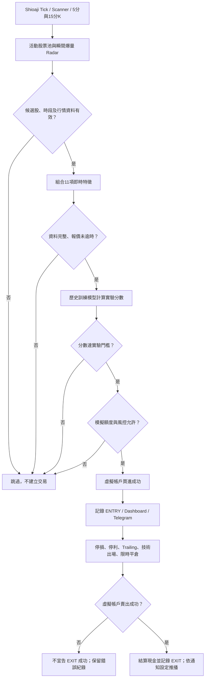

> 歷史敘述封存：VM 部署狀態未在 2026-09-27 的 repo 修正中重新驗證，請勿視為目前服務狀態。

# EasyStock｜AI 當沖判斷邏輯與純模擬交易

> 台股盤中量價監控 × 歷史資料模型 × **後台可設定虛擬本金** × Telegram 模擬成交通知  
> **By JimmyWei** · [開啟 EasyStock Dashboard](https://jimmyeyes03160729.github.io/easystock/)

**專案定位：**以即時行情找出值得研究的股票，交由歷史資料訓練的模型決定是否進行「模擬 ENTRY」，再由獨立的模擬帳務及出場規則追蹤結果。**目前不是實際自動下單系統，也不是已證明可獲利的策略。**

> **目前狀態（2026-09-21，台灣時間）：** AI 純模擬版已安裝在 Oracle VM；模型載入、人工特徵、帳務、重複 EXIT、出場分支、報價時效與 Telegram 發送已完成個別或離線測試。盤中 `service` 與 `timer` 目前保持停止；盤中真實資料下的端到端模擬交易、以及券商 API 的執行時禁止真實委託機制，**尚待驗收**。以下描述的是已實作的實驗邏輯，不代表系統正在自動交易。

## AI 如何決定當沖進場？



### 1. 雷達負責「發現股票」，AI 負責「決定模擬進場」

盤中引擎接收即時 Tick，透過活動股票池與 10／30／60 秒量能、買盤比例等雷達指標找到候選股；同時使用已完成的 5 分與 15 分 K 線作為趨勢特徵。**瞬間爆量本身不是買進指令。**

舊版規則策略的 `eligible`／分數／veto **不再作為新版 AI 模擬 ENTRY 的最後通行條件**；但舊策略計算出的 VWAP 距離、量比與 5／15 分 K 趨勢值，仍作為模型輸入。原有部位風控及技術 EXIT 沒有被這個進場模型取代。

### 2. 模型實際看的 11 項特徵

| 模型欄位 | 判斷資訊 |
|---|---|
| `gain_pct` | 相對前一交易日收盤價的漲跌幅（%） |
| `return_5m_pct` | 相對約 5 分鐘前成交價的報酬（%） |
| `surge_60s` | 最近 60 秒瞬間量能相對基準的倍數 |
| `buy_ratio_60s` | 最近 60 秒分類成交中的買盤占比 |
| `classified_ratio_60s` | 最近 60 秒成交方向可分類的比例 |
| `price_change_60_pct` | 最近 60 秒價格變動（%） |
| `vwap_distance_pct` | 價格相對 VWAP 的距離（%） |
| `volume_ratio` | 策略引擎計算的量比 |
| `five_trend` | 5 分 K 趨勢特徵值 |
| `fifteen_trend` | 15 分 K 趨勢特徵值 |
| `spread_pct` | Scanner 買一／賣一報價價差（%） |

模型使用上述欄位的固定順序進行標準化與邏輯迴歸（Logistic Regression）計算，並非每個 Tick 都向聊天式 AI 詢問「買不買」。

**缺值即跳過。** 缺少前收盤價、5 分鐘參考 Tick、雷達／K 棒特徵或有效買賣報價時，不能用 `0` 假裝資料完整。新進場使用的成交價 Tick 必須通過 30 秒時效檢查；Scanner 買賣價依**伺服器收到資料的時間**檢查，實驗設定上限 75 秒。這不是交易所原始報價時間保證，仍須檢驗即時行情品質。

### 3. 如何解讀 AI 分數？

目前測試模型版本為 `quote-markout-pilot-1`：以歷史盤中資料與後續約 15 分鐘的報價變化建立研究標籤，再輸出**實驗性排序分數**。研究標籤不是目前虛擬帳戶停損／停利規則的完整回測績效。

```text
模型特徵完整 → 算出 score → score >= 0.04 → 再檢查模擬帳戶與風控
```

`0.04` 是目前的**實驗選入門檻**，**不是「4% 勝率」、獲利機率或可獲利保證**。候選模型的研究檔仍標記 `deployment_allowed=false`；純模擬實驗不等於已獲准投入真實交易。歷史研究也尚未證明此門檻可帶來正的實際交易淨收益。

為避免重新啟動時意外換模型，VM 以 `AI_PAPER_MODEL_PATH` 固定候選模型檔，而不是每次自動抓最新檔；如需更換模型，應重新進行獨立資料驗證。

## 虛擬交易及出場

- **模擬本金：**由管理後台設定，可依測試需求調整（例如 NT$200,000、NT$500,000、NT$1,000,000）；持倉、可用現金與成交紀錄由模擬帳務資料庫管理。變更本金應透過後台既有流程，不以程式硬編碼固定金額。
- **模擬 ENTRY：**模型接受後仍需符合候選股、進場時段、每日上限、額度及部位限制；只有虛擬買進**實際成功**，才記錄 ENTRY 並發送模擬成交訊息。當前每日 ENTRY 硬上限為 **5 筆**，不保證每天有交易。
- **模擬 EXIT：**沿用停損、停利、Trailing、技術條件失效與 **12:55 強制平倉**等既有部位管理規則；虛擬帳戶回傳 `sold` 後才記錄成功 EXIT。再次賣出已無持倉者回傳 `no_position`，不得重複回款或通知。
- **時間（Asia/Taipei）：**09:00 開始監控；09:30 至 12:30 可評估新 ENTRY；12:30 後停止新進場；12:55 執行強制出場；13:00 結束盤中服務。
- **通知：**模擬交易訊息應明確標示「🧪 AI 模擬當沖」，目前以 Telegram 接收測試與模擬成交通知；LINE 是否推送依後台設定。只有通知 API 成功，不代表盤中交易流程已完成端到端驗收。

## 安全邊界與現階段限制

**盤中研究引擎的目標是只處理虛擬帳戶。** 既有管理後台的真實委託功能與 AI 模擬流程是不同入口，不應由 AI ENTRY／EXIT 呼叫。已做盤中相關程式靜態下單呼叫掃描，但這**不能取代**在執行時封鎖所有真實委託 API 的驗收。在確認該防線及交易時段的實際模擬流程前，盤中排程保持關閉；不要將本 README 視作「保證不會真實下單」的安全證明。

模擬成交價、行情延遲、滑價、交易成本與模型研究標籤可能有落差。即便紙上交易獲利，也不能直接推定真實市場表現。OpenAI 盤後復盤與此盤中 11 特徵模型是**不同流程**，盤後文字分析不會直接代替模型下 ENTRY。

## 專案架構及更多文件

公開 GitHub Repo 主要包含日線更新、Web Dashboard 與部分研究／`vm_runtime/` 程式；**Oracle VM 上正在驗收的實際執行檔與公開 Repo 不一定同步**。本 README 說明的是前述 VM 純模擬實驗狀態，不能僅憑 GitHub 原始碼推斷目前服務已啟動或已部署。

- [系統架構、資料契約與模組分工](docs/ARCHITECTURE.md)
- [既有部署／可靠性記錄](docs/RELIABILITY_UPDATE.md)
- [VM 程式來源與相依套件](vm_runtime/README.md)
- [舊版 README：規則策略、LINE 指令與其他功能說明（歷史紀錄）](docs/README_LEGACY_2026-09-15.md)

**免責聲明：**EasyStock 僅供個人研究、資訊展示及虛擬交易測試，不構成投資建議、獲利保證或實際委託授權。請勿將券商金鑰、Telegram Token、Firebase 憑證、`.env` 或正式交易資料提交至公開儲存庫。
