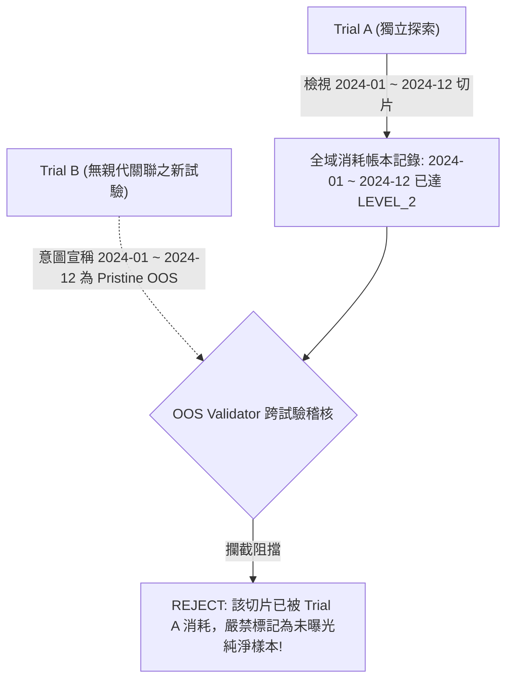

# EasyStock 量化研究治理：樣本外資料消耗與曝光帳本 (OOS_CONSUMPTION_LEDGER v1)

本文件定義 EasyStock 專案在量化交易與當沖研究中之**資料集中央註冊表（Central Dataset Registry）**、**樣本外消耗帳本（OOS Consumption Ledger）**、**曝光階層分級（Exposure Levels）** 與 **全域純淨資料保護治理規範（Global Pristine Data Governance）**。

---

## 1. 治理背景與架構定位

在量化策略研究中，樣本外（Out-of-Sample, OOS）與保留樣本（Holdout Data）是衡量策略是否具備真實預測力之唯一無偏依據。然而，若研究者反覆在同一批歷史資料上測試多種濾網、觀察分組績效、微調閾值，則原本宣告為「樣本外」的資料集便已在統計意義上被逐步消耗（Consumed）與污染（Contaminated）。

為了在整個研究專案全生命週期中精確追蹤每一筆資料切片的曝光狀態，EasyStock 建立正式的 **OOS_CONSUMPTION_LEDGER v1**。

### 重要治理區隔 (Governance Distinction)

本治理框架將研究元數據明確拆分為三大支柱，**嚴格禁止混淆為單一檔案**：

```
+-----------------------------------------------------------------------------------+
|                           THREE GOVERNANCE PILLARS                                |
+-----------------------------------------------------------------------------------+
| 1. Central Dataset Registry    | 「這些資料其實是不是同一批東西？」                |
|    (DATASET_REGISTRY_v1.yaml)  |  - 統一資料身分、資料族系與底層譜系 (Lineage)     |
|                                |  - 杜絕透過「更名」偽造獨立新資料                 |
+--------------------------------+--------------------------------------------------+
| 2. Research Trial Ledger       | 「研究做過什麼？」                                |
|    (RESEARCH_TRIAL_LEDGER)     |  - 盤點試驗假設、自由度、目標函式、搜尋空間       |
|                                |  - 鎖定試驗親代譜系與不可變 Commit SHA            |
+--------------------------------+--------------------------------------------------+
| 3. OOS Consumption Ledger      | 「資料被看過什麼？」                              |
|    (OOS_CONSUMPTION_LEDGER)    |  - 跨試驗追蹤特定切片被檢視之深度 (Exposure)    |
|                                |  - 判定資料是否仍具備 Pristine 純淨性             |
+-----------------------------------------------------------------------------------+
```

### 文獻與理論淵源宣告 (Source Attribution)

> [!NOTE]
> **現代治理擴充宣告（MODERN_GOVERNANCE_EXTENSION）**：
> 本套「全域機器可審核消耗帳本（Machine-Auditable OOS Consumption Ledger）」、「中央資料集註冊表」與「階層式曝光追蹤機制」，屬於 EasyStock 研究團隊之**現代工程治理擴充（Modern Governance Extension）**，並非 Robert Pardo (2008) *The Evaluation and Optimization of Trading Strategies* 書中所直接定義之原生物件。
> 
> 然而，本架構完全根植於 Pardo 所捍衛之核心量化哲學：
> 1. **嚴格樣本內／外分離（Strict IS/OOS Separation）**。
> 2. **未曝光樣本外評估（Unseen OOS Evaluation）**。
> 3. **步進式前向分析（Walk-Forward Analysis, WFA）**。
> 4. **過度擬合自由度控制（Overfitting & Degrees-of-Freedom Control）**。
> 5. **平緩高原最佳化（Parameter Plateau Robustness）**。

---

## 2. 中央資料集註冊表 (Central Dataset Registry)

實施於 [`docs/research_governance/DATASET_REGISTRY_v1.yaml`](file:///c:/Users/Jimmy/Projects/easystock/docs/research_governance/DATASET_REGISTRY_v1.yaml)。

### 核心身分治理原則
1. **Authoritative Identity Source**：Central Dataset Registry 是所有資料集身分、族系與譜系的唯一權威來源。驗證器與稽核工具一律以註冊表為準，不採信個別試驗自行宣告的名稱。
2. **禁止更名繞過（Anti-Rename Bypass）**：任何重新命名、子集合切片、欄位過濾之資料，凡其底層資料來源相同（相同 `dataset_lineage_id` 或 `dataset_family_id`），在時間區間重疊時，視為同一批實體資料。
3. **衍生資料繼承曝光（Derived Dataset Inherits Exposure）**：凡透過特徵工程、技術指標計算或多源合成產生的衍生資料（如 `TWSE_MARKET_CONTEXT_F01` 由台股現貨與期貨編譯而成），其時間區間自動繼承母體資料之所有曝光記錄。
4. **未知譜系處理（Unknown Lineage Policy）**：若資料譜系標記為 `LINEAGE_UNKNOWN`，嚴禁自動視為純淨樣本外，必須經由正式治理會議提出資料來源證明後方可解封。

---

## 3. 曝光深度分級 (Exposure Levels)

本框架杜絕僅用單一 `seen: true/false` 之粗糙二分法，將資料切片之曝光深度細分為 6 個層級：

| 曝光等級 | 代碼 | 定義與判定標準 | 治理後果與純淨性判定 |
| :--- | :--- | :--- | :--- |
| **Level 0** | `LEVEL_0_UNTOUCHED` | 資料從未被檢視過任何回測績效、標籤、統計值、特徵或行情數值。僅允許嚴格白名單之管理元數據檢驗（`ADMIN_METADATA_ONLY`）。 | **唯一允許宣稱 `pristine: true`**；具備最高等級獨立樣本外驗證資格。 |
| **Level 1** | `LEVEL_1_FEATURE_STRUCTURE_SEEN` | 檢視過特徵分佈、缺失值、資料管線健康度或日內時間戳結構，但未見任何目標變數或策略績效。 | `pristine: false`；可作為特徵工程探索，但不可再假裝為零接觸資料。 |
| **Level 2** | `LEVEL_2_AGGREGATE_METRICS_SEEN` | 檢視過該切片之全域聚合績效指標（如總報酬率、勝率、Profit Factor、最大回撤）。 | 聚合層級自由度已消耗，不可作為全新獨立驗證樣本。 |
| **Level 3** | `LEVEL_3_SUBGROUP_RESULTS_SEEN` | 檢視過細部子群切片結果：年度（year）、時段（time-of-day）、方向（direction）、候選策略（candidate）、市場體制（regime）、波動度（volatility）、寬度（breadth）或開盤量能（opening buckets）。 | 結構性子群自由度已大量消耗；後續研究**嚴禁針對這些已知子群進行事後微調並聲稱驗證**。 |
| **Level 4** | `LEVEL_4_PARAMETER_SELECTION_USED` | 該切片之表現結果被用於挑選參數組合、決定門檻值（thresholds）或入選後續候選策略名單（Candidate Selection）。*（註：此等級涵蓋廣義研究選擇 Broader Research Selection，未來演進建議名稱為 `LEVEL_4_RESEARCH_SELECTION_USED`）*。 | 參數搜尋或候選篩選之自由度已耗盡；此區間實質已非無偏保留區。 |
| **Level 5** | `LEVEL_5_REPEATED_RESEARCH_EXPOSED` | 同一切片被跨階段、多輪研究反覆使用或重新檢驗（例如 Phase 2B Batch 2 與 Phase 2C 重複探勘同一區間）。 | 高度資料窺探風險；僅能作為描述性分析（Descriptive Analysis），嚴格失去無偏度量效力。 |

### LEVEL_0 管理元數據白名單語意 (ADMIN_METADATA_ONLY)
為確保資料工程與管線維運不破壞樣本外保留區，LEVEL_0 明確劃定權限邊界：
* **允許檢查之白名單（Allowed Whitelist）**：
  1. `file_existence`：實體檔案或分區是否存在
  2. `ingestion_success`：資料收集入庫成功與否之布林值
  3. `schema_version`：資料格式架構版本
  4. `checksum`：檔案 SHA256 完整性雜湊值
  5. `trading_calendar_membership`：日期是否屬於台股開盤交易日
* **嚴格禁止檢查事項（Prohibited from LEVEL_0 — 一旦接觸即升級曝光等級）**：
  * OHLCV 價格數值
  * 市場衍生之列數／活動度統計（market-derived row/activity statistics，如 Tick 筆數分佈、成交量統計）
  * 特徵數值或分佈（feature values / distributions）
  * 標籤與訊號（labels / signals）
  * 損益、報酬率與績效／子群度量（PnL / returns / performance / subgroup metrics）

---

## 4. 全域跨試驗消耗模型 (Global Cross-Trial Exposure)

OOS Consumption Ledger 運作於**全域研究計畫層級（Global Research Program Level）**，而非單一試驗親代樹（Single Trial Tree）：



---

## 5. 消耗統計量與計數器 (Consumption Counter)

針對任意指定之資料集區間 $[T_{\text{start}}, T_{\text{end}}]$，驗證器提供計數器 `compute_slice_consumption_stats`：
* `total_consumption_events`：總消耗事件次數
* `train_consumption_count`：作為訓練集次數
* `oos_consumption_count`：作為樣本外評估次數
* `descriptive_consumption_count`：作為描述性機制分析次數
* `confirmation_consumption_count`：作為保留確認次數
* `human_exposure_count` / `ai_exposure_count`：人類與 AI 檢視次數
* `distinct_trial_count`：涵蓋之不重複試驗數
* `distinct_dimension_count`：已曝光之不重複維度清單與數量
* `max_exposure_level`：最高曝光等級
* `is_pristine`：是否純淨（僅當最高等級為 `LEVEL_0_UNTOUCHED` 且無任何實質消耗事件時為 true）

> [!IMPORTANT]
> **保留記錄（Reservation Record）不計入消耗事件**：
> 純保留之未來樣本外合約（如 `record_type: "RESERVATION"`, `consumed_at: null`）並非資料消耗行為，其對 `total_consumption_events`、`confirmation_consumption_count`、`human_exposure_count` 與 `ai_exposure_count` 的貢獻嚴格為 0，且狀態完整維持 `is_pristine: true`。

> [!TIP]
> 消耗統計量是**治理曝光會計（Exposure Accounting）**工具，用以盤點自由度消耗規模，並非等同於特定統計模型之 p-value 事後加罰（如 Bonferroni 校正）。

---

## 6. Phase 2 歷史回填與 Phase 2C 已燃燒維度

已如實回填於 [`docs/research_governance/oos_consumption/PHASE2_HISTORICAL_LEGACY_BACKFILL.yaml`](file:///c:/Users/Jimmy/Projects/easystock/docs/research_governance/oos_consumption/PHASE2_HISTORICAL_LEGACY_BACKFILL.yaml)：

| 消耗代碼 | 試驗來源 | 資料切片 | 角色 | 曝光等級 | 關鍵曝光維度 / 備註 |
| :--- | :--- | :--- | :--- | :--- | :--- |
| `CNS_P2A_FOUNDATION_EXPLORATION` | `TRIAL_P2A_FOUNDATION` | UNKNOWN（資訊不完整） | EXPLORATORY | `LEVEL_1` | 因果時鐘、Purge/Embargo 切分基元（無歷史回測日期區間） |
| `CNS_P2B_BATCH1_FULL_HISTORICAL_EVALUATION` | `TRIAL_P2B_BATCH1_CANDIDATE_SEARCH` | 2023-09-04 ~ 2026-10-02 | DESCRIPTIVE | `LEVEL_3` | aggregate, candidate, year, time-of-day, completeness, exit-policy, slippage, performance metrics |
| `CNS_P2B_BATCH1_WFA_FOLD1_TRAIN` | `TRIAL_P2B_BATCH1_CANDIDATE_SEARCH` | 2023-09-27 ~ 2025-01-03 | TRAIN | `LEVEL_4` | 18 種參數網格、Train 淨期望值 |
| `CNS_P2B_BATCH1_WFA_FOLD1_OOS` | `TRIAL_P2B_BATCH1_CANDIDATE_SEARCH` | 2025-01-08 ~ 2025-06-24 | OOS | `LEVEL_3` | candidate_oos_net_exp, oos_win_rate, oos_pf |
| `CNS_P2B_BATCH1_WFA_FOLD2_TRAIN` | `TRIAL_P2B_BATCH1_CANDIDATE_SEARCH` | 2024-03-06 ~ 2025-06-20 | TRAIN | `LEVEL_4` | 18 種參數網格、Train 淨期望值 |
| `CNS_P2B_BATCH1_WFA_FOLD2_OOS` | `TRIAL_P2B_BATCH1_CANDIDATE_SEARCH` | 2025-06-25 ~ 2025-11-20 | OOS | `LEVEL_3` | candidate_oos_net_exp, oos_win_rate, oos_pf |
| `CNS_P2B_BATCH1_WFA_FOLD3_TRAIN` | `TRIAL_P2B_BATCH1_CANDIDATE_SEARCH` | 2024-08-06 ~ 2025-11-18 | TRAIN | `LEVEL_4` | 18 種參數網格、Train 淨期望值 |
| `CNS_P2B_BATCH1_WFA_FOLD3_OOS` | `TRIAL_P2B_BATCH1_CANDIDATE_SEARCH` | 2025-11-21 ~ 2026-04-30 | OOS | `LEVEL_3` | candidate_oos_net_exp, oos_win_rate, oos_pf |
| `CNS_P2B_BATCH1_WFA_FOLD4_TRAIN` | `TRIAL_P2B_BATCH1_CANDIDATE_SEARCH` | 2025-01-06 ~ 2026-04-28 | TRAIN | `LEVEL_4` | 18 種參數網格、Train 淨期望值 |
| `CNS_P2B_BATCH1_WFA_FOLD4_OOS` | `TRIAL_P2B_BATCH1_CANDIDATE_SEARCH` | 2026-05-04 ~ 2026-09-29 | OOS | `LEVEL_3` | candidate_oos_net_exp, oos_win_rate, oos_pf |
| `CNS_P2B_BATCH1_WFA_FOLD5_TRAIN` | `TRIAL_P2B_BATCH1_CANDIDATE_SEARCH` | 2025-06-23 ~ 2026-09-23 | TRAIN | `LEVEL_4` | 18 種參數網格、Train 淨期望值 |
| `CNS_P2B_BATCH1_WFA_FOLD5_OOS` | `TRIAL_P2B_BATCH1_CANDIDATE_SEARCH` | 2026-09-30 ~ 2026-10-02 | OOS | `LEVEL_3` | candidate_oos_net_exp, oos_win_rate, oos_pf (端點殘缺切片) |
| `CNS_P2B_BATCH2_FILTER_EVALUATION` | `TRIAL_P2B_BATCH2_FILTER_STUDY` | 2023-09-04 ~ 2026-10-02 | OOS | `LEVEL_4` | 5 大濾網比較、篩選出 F01 作為後續分析 (candidate_selection_influenced: true, parameter_selection_influenced: false, research_direction_influenced: true) |
| `CNS_P2C_F01_MECHANISM_STUDY` | `TRIAL_P2C_F01_MECHANISM_FOLLOWUP` | 2023-09-27 ~ 2026-10-02 | DESCRIPTIVE | `LEVEL_5` | **Phase 2C 歷史 8 大維度（詳見下方）** |

### Phase 2C 歷史資料已燃燒之 8 大維度 (Burned Dimensions)
在 2023-09-27 至 2026-10-02 之歷史資料集上，以下 8 大維度已被完整檢視且反覆探勘，**全數喪失獨立樣本外資格**：
1. `F01 overall result`
2. `H01 trend-direction buckets`
3. `H02 volatility buckets`
4. `H03 opening 15m/30m buckets`
5. `H04 time-of-day`
6. `H05 breadth`
7. `H06 LONG/SHORT/candidate breakdown`
8. `H07 year/failure-regime descriptive results`

---

## 7. 未來 60 個交易日獨立確認保留合約

已建立於 [`docs/research_governance/oos_consumption/PHASE2C_FUTURE_CONFIRMATION_RESERVATION.yaml`](file:///c:/Users/Jimmy/Projects/easystock/docs/research_governance/oos_consumption/PHASE2C_FUTURE_CONFIRMATION_RESERVATION.yaml)：

* **起始日期**：`2026-10-05`
* **區間定義**：`first_60_eligible_trading_days`（非固定日曆結束日，開放累積直至滿 60 個符合條件之台股交易日）
* **當前狀態**：`RESERVED_UNTOUCHED`
* **曝光狀態**：
  * `performance_seen`: `false`
  * `labels_seen`: `false`
  * `aggregate_metrics_seen`: `false`
  * `subgroup_results_seen`: `false`
  * `human_seen`: `false`
  * `ai_seen`: `false`
  * `exposure_level`: `LEVEL_0_UNTOUCHED`
  * `independent_confirmation_completed`: `false`

### 嚴格查詢權限邊界
* **允許查詢（Permitted Queries — ADMIN_METADATA_ONLY）**：
  1. `file_existence`（檔案存在性）
  2. `ingestion_success`（資料收錄成功狀態）
  3. `schema_version`（資料格式架構版本）
  4. `checksum`（資料校驗雜湊）
  5. `trading_calendar_membership`（交易日曆資格檢驗）
* **嚴格禁止查詢（Prohibited Queries — 任何行情與成果接觸）**：
  1. `ohlcv_values`（任何開高低收成交量價格）
  2. `market_derived_activity_statistics`（市場活動度或逐筆統計）
  3. `feature_values_or_distributions`（特徵值或分佈）
  4. `labels` / `signals`（標籤或策略訊號）
  5. `pnl` / `returns`（損益或報酬率）
  6. `performance_metrics` / `subgroup_metrics`（勝率、盈虧比、各類分組績效）
  嚴禁以「測試系統管線」為由讀取任何行情價格或績效相關欄位！

---

## 8. 驗證器檢查規則 (Validator Rules Summary)

實作於 [`validate_oos_consumption.py`](file:///c:/Users/Jimmy/Projects/easystock/daytrade_learning/research_governance/validate_oos_consumption.py)：
1. **Consumption ID Uniqueness**：全域唯一，符合 `^CNS_[A-Za-z0-9_]+$` 規範。
2. **Registry Existence**：`dataset_id` 必須在 `DATASET_REGISTRY_v1.yaml` 中正式註冊。
3. **Registry Identity Authoritative Match**：`dataset_family_id` 與 `dataset_lineage_id` 必須嚴格等於註冊表數值，禁止自行篡改。
4. **Valid Date Ranges**：滿足 `start_date <= end_date`，且必須位於註冊資料集所宣告之邊界內。
5. **No Re-pristining**：已曝光切片嚴禁在後續事件中宣稱 `pristine_before: true`；已達 Level 1~5 者嚴禁標記 `pristine_after: true`。
6. **Lineage Anti-Bypass**：更名資料集若同屬相同 Lineage，重疊區間一律繼承既有曝光。
7. **Parent-Child Derivation Inheritance**：衍生特徵集自動繼承母體歷史資料區間之曝光等級。
8. **Reserved Untouched Integrity**：保留合約必須零成果接觸，且不可標記已完成確認。
9. **Legacy Backfill Fidelity**：歷史回填必須誠實標註 `recorded_after_exposure: true`。
10. **Unknown Lineage Conservative Gate**：`LINEAGE_UNKNOWN` 嚴禁自動宣稱純淨或獨立驗證資格。
