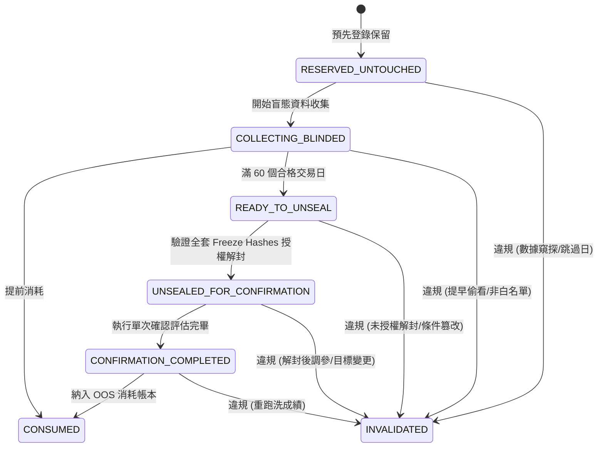

# EasyStock 未曝光樣本治理政策 (Pristine Holdout Policy v1)

本文件定義 EasyStock 量化研究體系中，針對**未曝光樣本保留區（Pristine Holdout Partition）**的正式治理合約與機器可查驗規則。

---

## 1. 目的與哲學背景

本政策奠基於經典量化金融研究之嚴格樣本外原則（如 **Robert Pardo (2008), *The Evaluation and Optimization of Trading Strategies***），並擴充為現代化、可防範 AI 與自動化探勘偏差之研究治理框架：

* **Pardo 原則的核心實踐**：
  * **完全未見之樣本外資料（Strictly Unseen Out-of-Sample Data）**：優化過程嚴格不得接觸確認樣本。
  * **禁止資料窺探（No Data Peeking）**：在優化或參數選定前，不得預先窺視驗證區間的任何度量。
  * **樣本隔離防止過度擬合（Overfitting Control via Sample Isolation）**。
* **現代治理擴充（Modern Governance Extension）**：
  * **AI 存取非例外原則**：任何大型語言模型（LLM）、代理人（Agent）或自動化評估腳本存取未來結果，均等同於實質曝光。
  * **不可逆狀態機與無重新純淨化（No Re-Pristining）**。
  * **全套凍結雜湊（Freeze Hashes）審計解封**。
  * **單次確認即刻消耗（One-Shot Confirmation Consumption）**。

---

## 2. Holdout 生命週期狀態機 (Lifecycle States)

Holdout 資料切片嚴格依循單向推進的 7 狀態生命週期：

### 狀態清單與定義

| 狀態名稱 | 純淨性 (`pristine`) | 終態 | 說明 |
| :--- | :---: | :---: | :--- |
| `RESERVED_UNTOUCHED` | **true** | false | 正式登錄保留合約，尚未進行任何結果或行情數值讀取。 |
| `COLLECTING_BLINDED` | **true** | false | 資料管線正在盲態收集合格交易日，僅允許管理元數據檢查。 |
| `READY_TO_UNSEAL` | **true** | false | 經審計正好收集滿 60 個合格交易日，等待正式解封授權。 |
| `UNSEALED_FOR_CONFIRMATION` | **false** | false | 經全套凍結雜湊審核授權，正式解封進行單次確認評估。 |
| `CONFIRMATION_COMPLETED` | **false** | false | 單次確認評估執行完畢，結果詞彙已寫入記錄。 |
| `CONSUMED` | **false** | **true** | 樣本完全消耗，已記錄於 OOS Consumption Ledger。 |
| `INVALIDATED` | **false** | **true** | 發生治理違規（如偷看、解封後改參、結果偏誤剔除等），資格作廢。 |

> [!CAUTION]
> **No Re-Pristining 鐵律**：
> 任何已進入 `UNSEALED_FOR_CONFIRMATION`、`CONFIRMATION_COMPLETED`、`CONSUMED` 或 `INVALIDATED` 的切片，**嚴格禁止以任何理由轉回 `RESERVED_UNTOUCHED`、`COLLECTING_BLINDED` 或 `READY_TO_UNSEAL`**。

---

## 3. 盲態收集規範 (Blinded Collection Rules)

在 `RESERVED_UNTOUCHED`、`COLLECTING_BLINDED` 與 `READY_TO_UNSEAL` 階段，存取權限受到嚴格白名單限制：

### 允許之管理元數據白名單 (`ADMIN_METADATA_ONLY`)
1. `file_existence`：實體檔案／分區是否存在。
2. `ingestion_success`：入庫程序是否成功完成（布林值）。
3. `schema_version`：資料表架構版本。
4. `checksum`：原始檔案之 SHA256 完整性雜湊。
5. `trading_calendar_membership`：日期是否屬於證交所開盤日。

### 嚴格禁止事項（一旦觸犯立即視為曝光，狀態轉為 `INVALIDATED`）
* OHLCV 價格數值與日內波動。
* 資料列數、Tick 筆數或市場活動統計（Activity Statistics）。
* 特徵數值或特徵分佈（Feature Values / Distributions）。
* 標籤與訊號（Labels / Signals）。
* 候選策略輸出（Candidate Outputs）。
* 損益與報酬率（PnL / Returns）。
* 全域聚合績效指標（Aggregate Metrics: Sharpe, Win Rate, Profit Factor 等）。
* 子群切片績效（Subgroup Metrics: 體制、年度、時段、方向等）。

---

## 4. 合格交易日定義 (Eligible Trading Day Definition)

為了防止「因結果不佳而跳過某天」的選擇偏差（Outcome-Dependent Skipping），合格交易日的認定必須在**解封前預先登記（Preregistered）**，且**僅能依賴與市場結果無關之資料工程元數據**。

一個日期 $D$ 判定為合格交易日之充要條件：
$$\text{Eligible}(D) = \text{OfficialCalendar}(D) \land \text{PartitionExists}(D) \land \text{IngestionSuccess}(D) \land \text{SchemaValid}(D) \land \text{ChecksumValid}(D)$$

### 嚴禁使用的判定條件 (Prohibited Criteria)
* 當日市場成交量高低
* 100 檔股票池當日標的數多寡
* 策略是否計算出理想訊號
* 訊號筆數（Signal Count）
* 市場整體漲跌幅或波動度
* 候選策略之損益好壞

---

## 5. 人類與 AI 存取政策 (Human / AI Access Policy)

* 在 `READY_TO_UNSEAL` 之前：
  * `human_outcome_access`: **false**
  * `ai_outcome_access`: **false**
  * `automated_research_outcome_access`: **false**
* **AI 存取即曝光原則**：
  任何由大型語言模型（ChatGPT、Gemini、Antigravity、Codex）或自動化評估工具讀取帶有結果之數據，皆算作研究曝光（Research Exposure），**AI 絕非治理豁免區**。

---

## 6. 60 天計數器與禁止提早偷看 (Completion & Interim Peek)

Holdout 的解封門檻僅能由計數器推進：
$$\text{eligible\_days\_collected} == 60$$

### 嚴禁任何形式的事前偷看（Interim Peek）
* 收集到第 20 天時「先看一下表現」
* 收集到第 40 天時「確認一下趨勢」
* 跑 Rolling interim performance
* 「只看一眼勝率，不調參數」
* 「只看總體 Aggregate，不看個別交易」

**任何偷看行為皆立即燃燒該 Holdout，使其喪失獨立確認資格。**

---

## 7. 解封授權與全套凍結雜湊 (Unseal Authorization & Freeze Hashes)

`READY_TO_UNSEAL` 僅代表條件具備，**絕不代表自動解封**。必須由權限實體發布包含以下 12 項不可或缺之欄位的 `authorization_record`：

1. `authorization_id`
2. `authorized_at`
3. `authorized_by`
4. `trial_id`
5. `objective_spec_hash`
6. `trial_preregistration_hash`
7. `dataset_registry_hash`
8. `pre_unseal_oos_consumption_ledger_hash`（*解封消費事件追加前一刻之 OOS 消耗帳本權威快照雜湊*）
9. `holdout_policy_hash`
10. `code_commit_sha`
11. `cost_model_hash`
12. `evaluation_plan_hash`

若任一雜湊缺失或不匹配，驗證器將拒絕進入 `UNSEALED_FOR_CONFIRMATION`。

> [!IMPORTANT]
> **Pre-unseal 帳本雜湊審計語意**：
> 授權紀錄鎖定的是追加解封事件**正前一刻**的 OOS 消耗帳本雜湊。後續追加新事件所導致的帳本雜湊改變，絕不可被驗證器誤判為「授權快照被篡改（mutation）」。新追加之解封事件本身必須回溯參照 `triggered_by_authorization_id` 與 `pre_unseal_ledger_hash`。

---

## 8. 解封與消耗之原子性 (Atomic Unseal & Consumption)

為杜絕「偷看結果卻未登記消耗」的黑箱漏洞，政策強制要求解封與消耗行為具備**不可分割之原子性（Atomic Execution）**：

在進行**任何第一次帶有市場結果（Outcome-Bearing）的讀取**之前，系統必須嚴格依序且原子化完成：
1. **授權驗證通過（Authorization Verification PASS）**：比對所有 Freeze Hashes 完整無誤。
2. **登記消耗事件（Register Consumption Event）**：在 OOS Consumption Ledger 正式追加相應之 Holdout 消耗事件。
3. **狀態原子轉移（Atomic State Transition）**：將 Holdout 狀態切換為 `UNSEALED_FOR_CONFIRMATION`。

**只有在上述三項步驟全數確認完成後，才允許執行第一次 outcome 讀取。**

---

## 9. 單次確認合約 (One-Shot Confirmation Contract)

* `confirmation_mode: ONE_SHOT`
* 第一次 outcome evaluation 即宣告 Holdout 正式消耗。
* **嚴禁「評估 $\to$ 微調 $\to$ 同一批 60 天重測 $\to$ 宣稱通過」之惡劣實踐**。
* 解封當下，必須在 OOS Consumption Ledger 中同步建立相應的消耗事件。

---

## 9. 確認結果詞彙與 Production Ready 嚴格隔離

為避免與實際上線核准（Production Approval）混淆，確認結果僅允許使用以下 4 種標準詞彙：

* `SUPPORTED_WITHIN_PREREGISTERED_SCOPE`：在預先登記之指標與範圍內獲得支持。
* `NOT_SUPPORTED`：未達預先登記之確認標準。
* `INCONCLUSIVE`：因不可抗力或樣本特徵不足導致無法有效判定。
* `INVALIDATED`：評估過程違反合約或遭受干擾。

### 獨立生產準備防線
無論確認結果為何：
$$\text{production\_ready} \equiv \text{false}$$
確認通過僅代表統計假設在未見樣本中成立，**永遠不得自動轉為真實交易或生產部署許可**。
