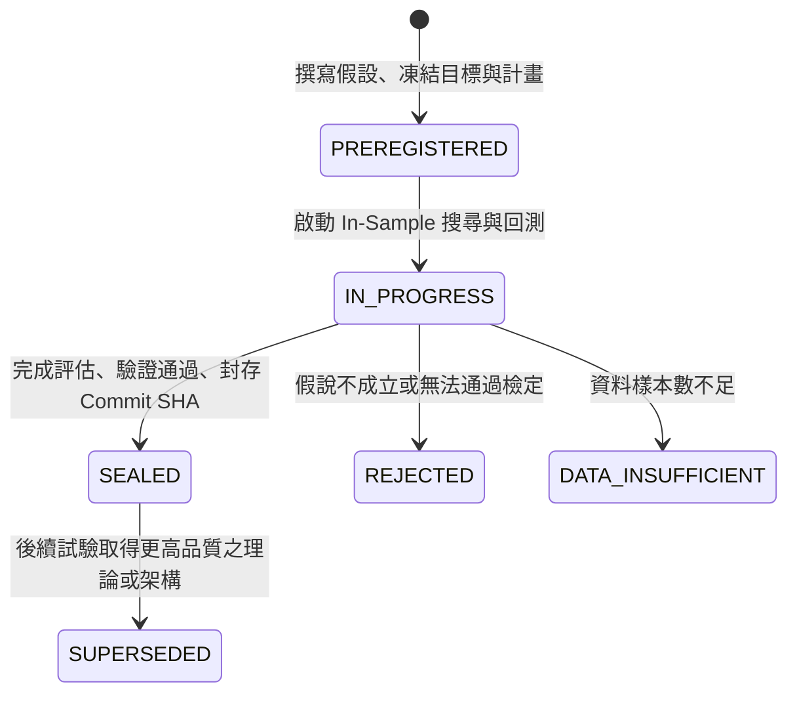

# EasyStock 量化研究治理：研究試驗帳本 (RESEARCH_TRIAL_LEDGER v1)

本文件定義 EasyStock 專案量化交易與當沖研究之試驗帳本（Research Trial Ledger）治理框架、Pardo 自由度治理原則、試驗註冊與驗證生命週期，以及歷史試驗回填（Legacy Backfill）狀態。

---

## 1. 治理背景與系統目的

量化交易研究極易受到**資料窺探（Data Snooping）**、**多重假設檢定（Multiple Testing Bias / P-hacking）** 與 **事後目標置換（Post-hoc Objective Switching）** 之系統性扭曲。若研究者在看到測試集（OOS）表現後反覆微調過濾條件、修改特徵閾值或更換衡量指標，回測所得之統計顯著性將完全失效。

為了杜絕此類「過度擬合歷史假象」之研究風險，EasyStock 建立正式的 **Research Trial Ledger v1** 機制：
1. **全面盤點自由度（Degrees-of-Freedom Accounting）**：凡是研究者或 AI 探勘過的參數組合、特徵維度、切片結果，皆必須誠實記錄於帳本中。
2. **事前註冊強制凍結（A Priori Preregistration）**：正式搜尋前必須先凍結假設、目標函式、搜尋空間與驗證計畫。
3. **單一不可變追蹤（Immutable Provenance）**：每筆試驗具備明確親代鏈接（Parent-Child Lineage），並與 Git Commit SHA 及規範 Hash 綁定。
4. **零生產環境影響（Zero Production Impact）**：所有研究試驗嚴格限定於研究治理範疇，`production_effect` 必須為 `NONE`，絕不干擾實體或現行模擬執行環境。

---

## 2. Pardo 自由度治理與評估原則

本框架依據 Robert Pardo (2008) 所著 *The Evaluation and Optimization of Trading Strategies* 之步進式前向分析（Walk-Forward Analysis, WFA）與自由度理論，制定核心不變量（Governance Invariants）：

```
+-------------------------------------------------------------------------+
|                        PARDO DOCTRINE & WFA SPLIT                       |
+-------------------------------------------------------------------------+
|  [ In-Sample (Train) Partition ]  |  [ Out-of-Sample (Test/OOS) Partition ]
|  - 參數網格搜尋 (Grid Search)      |  - 嚴格只讀一次 (Single Read Only)     |
|  - 最佳化挑選 (Optimization)      |  - 無偏績效度量 (Unbiased Measurement) |
|  - 參數高原檢驗 (Plateau Check)    |  - 禁止任何參數微調 (NO OOS Tuning)   |
+-------------------------------------------------------------------------+
```

### 核心治理不變量（Governance Invariants）
1. **Train-Only Selection**：最佳參數與篩選條件之挑選，只能基於 In-Sample (Train) 資料集。
2. **No OOS Tuning**：嚴格禁止利用 OOS 評估表現來回溯修正候選參數、閾值或模型架構。
3. **Robust Plateau Required**：在 Train 最佳化時，選定之參數必須位於平緩寬闊的高原（Parameter Plateau），嚴格禁止挑選孤立突波尖峰（Isolated Spike）。
4. **Exposure State Tracking**：
   - 一旦資料切片或特定維度被研究者檢視（`oos_seen: true`），其自由度便已被消耗。
   - 消耗後的維度在後續研究中**絕對不得被偽裝成未曝光之純淨樣本外（Pristine OOS）**。

---

## 3. 目標函式規範 (OBJECTIVE_FUNCTION_SPEC_v1)

所有搜尋與選模皆須遵從 [OBJECTIVE_FUNCTION_SPEC_v1.yaml](file:///c:/Users/Jimmy/Projects/easystock/docs/research_governance/OBJECTIVE_FUNCTION_SPEC_v1.yaml)：

### 允許之主要評估指標
* **`delta_net_return_pct`**：濾網過濾後相較於未過濾 Baseline 之淨報酬率增量（扣除滑價與交易摩擦）。
  $$\Delta \text{Net Return} = \text{Net Return}_{\text{filtered}} - \text{Net Return}_{\text{baseline}}$$
* **`delta_net_expectancy_R`**：以初始風險（R）標準化之淨期望值增量。
* **`filtered_profit_factor`**：過濾後交易之總獲利除以總虧損比率（Profit Factor），門檻值要求 $\ge 1.05$。

### 嚴格禁止事項（Disallowed Practices）
* **OOS_PARAMETER_TUNING**：觀察 OOS 後調整參數。
* **POST_HOC_OBJECTIVE_SWITCHING**：回測完成後因原始指標不理想而更換成其他表現較佳的指標。
* **ISOLATED_PEAK_SELECTION**：未檢驗鄰近參數穩定度即選取局部尖峰。
* **LABEL_LEAKAGE / CAUSAL_VIOLATION**：跨 Fold 或時序未來資訊洩漏。
* **SILENT_DROPPING**：在試驗報告中隱匿失敗的參數嘗試。

---

## 4. 試驗生命週期與反歷史竄改原則 (Anti-Historical Revisionism)

### 試驗生命週期狀態機


### 反歷史竄改原則（Anti-Historical Revisionism）
針對在 Research Trial Ledger 機制建立前完成之歷史階段（Phase 2A、Phase 2B Batch 1、Phase 2B Batch 2、Phase 2C），**嚴禁事後捏造或偽稱其具備正式事前註冊**：
* 必須明確標註 `ledger_record_type: "LEGACY_BACKFILL"`。
* 必須標註 `recorded_after_experiment: true`。
* 若當時並無獨立之事前目標規格書，必須如實標註 `objective.preregistered: false` 與 `objective.historical_information_incomplete: true`。

---

## 5. 驗證器規格與驗證規則 (Validator Rules)

驗證器實作於 [validate_trial_ledger.py](file:///c:/Users/Jimmy/Projects/easystock/daytrade_learning/research_governance/validate_trial_ledger.py)，實施以下 10 項強制檢查：

1. **Schema Compliance**：符合 `RESEARCH_TRIAL_LEDGER_SCHEMA_v1.yaml` 定義之所有必要欄位與資料型別。
2. **Unique Trial ID**：每一筆 Trial 的 `trial_id` 全域唯一，不得重複。
3. **Valid Parent Lineage**：根試驗（Root Trial）之 `parent_trial_id` 必須為 `null`；其餘試驗之 `parent_trial_id` 必須存在於已知試驗清單中，形成無環有向樹。
4. **Sealed Immutability**：已標記 `status: "SEALED"` 且綁定 `sealed_commit` 的試驗，其核心欄位不得任意竄改。
5. **Valid Data Dates**：資料區間必須合法，滿足 `start_date <= end_date`。
6. **Non-Empty Objective**：必須包含明確之評估指標 `primary_metric` 與方向 `direction`。
7. **Hypothesis Consistency**：`preregistered` 與 `exploratory` 不得自相矛盾（不可同時為 true）。
8. **Dataset/Slice-Scoped Exposure & Independent Confirmation Integrity (含 Lineage 防繞過與未來預留語義)**：
   - 採用資料集、譜系與時間區間限定（Dataset Family / Lineage / Slice-Scoped）模型，禁止以單一全域 bool 永久污染未來資料。
   - **Lineage 防繞過機制**：凡具有相同資料族系（`dataset_family_id`）或底層資料譜系（`dataset_lineage_id`）之資料集，即使 `dataset_id` 重新命名或更名，只要時間區間重疊，一律視為已曝光，嚴禁宣稱 `independent_confirmation: true`。
   - 曾作為 `HOLDOUT` 或 `OOS` 檢視之切片，嚴禁再次宣稱未曝光（pristine）。
   - **未來確認預留語義**：對於尚未解封之未來樣本（如 `end_date: null` 之不可變合約），必須標記 `intended_independent_confirmation: true`、`confirmation_status: "RESERVED_UNTOUCHED"`、`performance_seen: false` 與 `independent_confirmation_completed: false`。在實際觀測績效前，嚴禁宣稱已完成獨立確認。
   - 嚴格位於所有已曝光區間之後的未來確認切片，或未曾曝光之不同資料族系，允許於解封完成後宣稱完成獨立確認。
   - 開放式未來確認合約在未實際讀取前，必須明確標記 `FUTURE_CONFIRMATION_UNTOUCHED: true`。
9. **Zero Production Effect**：`governance.production_effect` 必須嚴格為 `"NONE"`，不允許任何其他字串。
10. **Legacy Backfill Integrity**：凡是 `ledger_record_type: "LEGACY_BACKFILL"`，嚴格禁止宣稱其為未污染事前註冊（不可 `recorded_after_experiment: false`）。若歷史自由度計數不完整，必須誠實設為 `null` 並標註 `historical_information_incomplete: true`。

---

## 6. 已回填之 4 個歷史試驗摘要 (Legacy Backfill Summary)

以下 4 筆試驗已如實回填於 `docs/research_governance/trials/`：

| Trial ID | Research Stage | Record Type | Sealed Commit | Decision / Status |
| :--- | :--- | :--- | :--- | :--- |
| [`TRIAL_P2A_FOUNDATION`](file:///c:/Users/Jimmy/Projects/easystock/docs/research_governance/trials/P2A_LEGACY_BACKFILL.yaml) | Phase 2A | `LEGACY_BACKFILL` | `a33708d8` | 奠定因果時序、滑價扣抵與 Purge/Embargo 基礎基元 |
| [`TRIAL_P2B_BATCH1_CANDIDATE_SEARCH`](file:///c:/Users/Jimmy/Projects/easystock/docs/research_governance/trials/P2B_BATCH1_LEGACY_BACKFILL.yaml) | Phase 2B Batch 1 | `LEGACY_BACKFILL` | `b351e6b2` | 4 候選策略（18 個參數組合，1,591,201 筆訊號，5 出場 × 4 滑價 = 31,824,020 筆模擬評估；trial_count 設為 null） |
| [`TRIAL_P2B_BATCH2_FILTER_STUDY`](file:///c:/Users/Jimmy/Projects/easystock/docs/research_governance/trials/P2B_BATCH2_LEGACY_BACKFILL.yaml) | Phase 2B Batch 2 | `LEGACY_BACKFILL` | `ac5b660f` | 評估 5 類濾網，保留 F01 市場環境濾網作為機制分析候選 |
| [`TRIAL_P2C_F01_MECHANISM_FOLLOWUP`](file:///c:/Users/Jimmy/Projects/easystock/docs/research_governance/trials/P2C_F01_LEGACY_BACKFILL.yaml) | Phase 2C | `LEGACY_BACKFILL` | `8ceb6a94` | F01 機制與失效體制深入分析（確認方向不對稱性，非強度單調性；未來確認保持 RESERVED_UNTOUCHED） |

### Phase 2C 歷史研究已曝光之 8 大維度（Burned Dimensions）
於 `TRIAL_P2C_F01_MECHANISM_FOLLOWUP` 中，以下 8 個維度已在 2023-09-27 至 2026-10-02 之歷史資料集上被研究者與模型完全檢視：
1. `F01 overall result`：整體過濾後 Net Return 改善但摩擦與成交率變化。
2. `H01 trend-direction buckets`：Q1/Q2 改善、Q3/Q4 惡化之方向不對稱性（非趨勢強度單調改善）。
3. `H02 volatility buckets`：MID/HIGH 正向改善、LOW 因摩擦偏高導致淨值惡化。
4. `H03 opening 15m/30m buckets`：開盤 15m/30m 方向與全日走勢之濾網相容性。
5. `H04 time-of-day`：OPEN 正向、MID 惡化、LATE 最強改善之日內時段分佈。
6. `H05 breadth`：漲跌家數寬度分佈（55-79 區間呈現負值，非單調改善）。
7. `H06 LONG/SHORT/candidate breakdown`：4 候選策略多空不對稱性。
8. `H07 year/failure-regime descriptive results`：各年度結構特徵與重大失效日體制描述。

> [!WARNING]
> **自由度已耗損警示（Expended Degrees of Freedom）**：
> 以上 8 大維度已於歷史資料集上深度探勘。在未來任何 Phase 2D 或後續試驗中，**嚴禁將上述維度在 2023-09-27 ~ 2026-10-02 區間上的結果作為獨立純淨樣本外證據**。
> 所有針對上述維度的進一步假說驗證，必須嚴格保留於 `2026-10-02` 之後未曝光的未來確認樣本（`FUTURE_CONFIRMATION_UNTOUCHED: true`）。

---

## 7. 未來研究試驗操作指引 (Future Research Protocol)

自 Step 2 起，任何新的研究試驗（Phase 2D 及後續模組）均須遵循標準流程：
1. 在 `docs/research_governance/trials/` 下建立試驗規格檔（如 `TRIAL_P2D_xxx.yaml`），填寫 `parent_trial_id`、假說、目標函式與搜尋空間。
2. 標記 `ledger_record_type: "PREREGISTERED_TRIAL"` 與 `recorded_after_experiment: false`。
3. 執行驗證器：`python -m daytrade_learning.research_governance.validate_trial_ledger`。
4. 驗證通過後，在 In-Sample 進行參數與模型最佳化。
5. 完成後填寫結果與 Commit SHA，封存為 `SEALED` 或 `REJECTED`。
