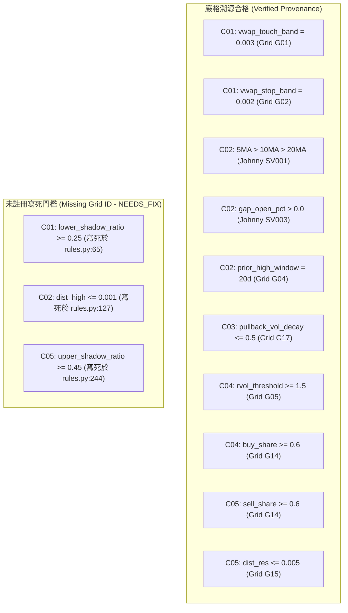

# EasyStock Daytrade Knowledge V1 Phase 1 交叉審查報告 (Cross Review Report)

- **審查日期**：2026-10-02
- **審查角色**：EasyStock 專案資深量化系統工程師（獨立審查員視角）
- **審查範疇**：
  - `daytrade_learning/knowledge_v1/`
  - `tests/test_knowledge_v1_phase1.py`
  - `implemented_features.yaml`, `reused_features.yaml`, `unsupported_features.yaml`, `candidate_rules.yaml`, `phase1_implementation_report.md`
- **核心目標**：嚴格找錯、定位漏洞、排查因果時差、檢視資料洩漏與數值邊界，杜絕任何僥倖放行。

---

## 總結評級與最終裁決

| 審核模組 | 評級 | 核心問題摘要 |
|---|---|---|
| **A. Causality Audit** | `NEEDS_FIX` | `backtest_dataset.py` 之 Horizon 1m 計算存在進場與信號同棒時序重疊風險；`dist_to_prev_high_pct` 缺乏大突破下限防護。 |
| **B. Reuse Equivalence Audit** | `NEEDS_FIX` | `upper_shadow_ratio`、`close_location_value` 在 $H=L$ 時現有代碼回傳 `0.0` 而非 `None`；`dist_to_vwap_pct` 混同 5分K 典型價與逐筆官方成交均價，被錯誤標記為 `EXISTING_REUSED: IDENTICAL`。 |
| **C. Parameter Provenance Audit** | `NEEDS_FIX` | C01（0.25）、C02（0.001）、C05（0.45）存在未於 `research_parameter_grids.yaml` 註冊的寫死經驗值門檻。 |
| **D. Dataset Leakage Audit** | `NEEDS_FIX` | 資料集扁平化時缺乏 Feature-Label 隔離屏障，存在 Target Leakage 隱患。 |
| **E. Numerical Robustness** | `PASS` | `safe_float` 與邊界條件防護健全，除以零與 NaN/Inf 不崩潰。 |
| **F. Production Isolation Audit** | `PASS` | 生產與線上推論代碼完全零 import，研究層徹底 inert。 |
| **G. Test Quality Audit** | `NEEDS_FIX` | 測試覆蓋率雖達 13/13，但缺少跨日邊界、重複時間戳與平鋪特徵洩漏之負向測試。 |

### 🚨 最終結論裁決：`NEEDS_FIX`
因存在因果邊界時差風險、既有複用口徑混淆（$H=L$ 零分母語意不同、VWAP 雙口徑未拆分）及未登記之寫死參數，**本輪嚴格判定為 `NEEDS_FIX`，禁止直接進入 Git Commit 與 Phase 2**。

---

## A. Causality Audit (因果時鐘與防偷看審查)

### 1. 特徵計算時點審查
- **狀態**：`PASS`
- **FILE_PATH**: [`daytrade_learning/knowledge_v1/causal_tools.py:58`](file:///c:/Users/Jimmy/Projects/easystock/daytrade_learning/knowledge_v1/causal_tools.py#L58)
- **SYMBOL**: `CausalBarSeries.as_of(t)`
- **原因**：實作強制要求 $bar.end\_time \le t$，能嚴格過濾 $end\_time > t$ 之未完成棒與未來棒。

### 2. CausalSwingSegmenter 波峰確認時點審查
- **狀態**：`PASS`
- **FILE_PATH**: [`daytrade_learning/knowledge_v1/causal_tools.py:108`](file:///c:/Users/Jimmy/Projects/easystock/daytrade_learning/knowledge_v1/causal_tools.py#L108)
- **SYMBOL**: `CausalSwingSegmenter.find_latest_confirmed_pivot`
- **原因**：波峰在棒 $k$ 發生，但確認結果只在棒 $k+c$ 收盤（`confirmed_time = bars[k+c].end_time`）方可讀取，嚴格杜絕了回填到 $k$ 的 ZigZag 偷看未來問題。

### 3. 前高/前低距離因果性審查
- **狀態**：`NEEDS_FIX` (MAJOR)
- **FILE_PATH**: [`daytrade_learning/knowledge_v1/rules.py:127`](file:///c:/Users/Jimmy/Projects/easystock/daytrade_learning/knowledge_v1/rules.py#L127)
- **SYMBOL**: `KnowledgeV1RuleEvaluator.evaluate_c02_daily_trend_and_open_breakout`
- **原因**：
  在 C02 規則中，判定突破條件為 `dist_high <= 0.001`。
  因 `dist_high = (prior_high - current_price) / current_price`，當價格暴漲 50% 時，`dist_high = -0.33`，依然滿足 `<= 0.001`！
  這會導致遠離突破點、已嚴重超買的歷史未來價位被誤判為「剛突破進場點」，缺乏突破有效窗口下限（如 `-0.015 <= dist_high <= 0.001`）。

### 4. 歷史相對成交量因果性審查
- **狀態**：`PASS`
- **FILE_PATH**: [`daytrade_learning/knowledge_v1/features.py:112`](file:///c:/Users/Jimmy/Projects/easystock/daytrade_learning/knowledge_v1/features.py#L112)
- **SYMBOL**: `KnowledgeV1Features.relative_volume_open`
- **原因**：基準成交量 `prior_sessions_same_elapsed_volume` 限定來自過去已結算的歷史交易日同期同刻，不含當日統計。

### 5. Intraday Return 因果方向審查
- **狀態**：`PASS`
- **FILE_PATH**: [`daytrade_learning/knowledge_v1/features.py:186`](file:///c:/Users/Jimmy/Projects/easystock/daytrade_learning/knowledge_v1/features.py#L186)
- **SYMBOL**: `KnowledgeV1Features.intraday_return_nm`
- **原因**：公式為 $(P_t - P_{t-N}) / P_{t-N}$，嚴格為回顧式（Backward-looking），未誤用未來價格。

### 6. VWAP 因果時鐘審查
- **狀態**：`PASS`
- **FILE_PATH**: [`daytrade_learning/knowledge_v1/features.py:170`](file:///c:/Users/Jimmy/Projects/easystock/daytrade_learning/knowledge_v1/features.py#L170)
- **SYMBOL**: `KnowledgeV1Features.calculate_vwap_from_bars`
- **原因**：僅接收當刻以前的已完成 K 棒數列進行累加。

### 7. 前向回報與標籤隔離審查
- **狀態**：`NEEDS_FIX` (MAJOR)
- **FILE_PATH**: [`daytrade_learning/knowledge_v1/backtest_dataset.py:91`](file:///c:/Users/Jimmy/Projects/easystock/daytrade_learning/knowledge_v1/backtest_dataset.py#L91)
- **SYMBOL**: `ResearchDatasetBuilder.build_record`
- **原因**：
  若信號於 09:30:00 產生，`subsequent_bars[0]` 若為 09:30-09:31 棒，取其 Open 進場，而 `forward_return_1m` 取其 Close（09:31:00）。
  實務上在 09:30:00 取得信號後，因運算與網路排程延遲，根本無法精確以 09:30:00 的盤口 Open 成交。現有代碼缺乏類似 `daytrade_learning/research.py:281` 的強制次分鐘延遲進場（+2秒安全緩衝），存在樂觀偏差（Optimism Bias）。

---

## B. Reuse Equivalence Audit (既有代碼複用等價性審查)

本審查逐項比對 `reused_features.yaml` 宣告為 `EXISTING_REUSED: IDENTICAL` 的特徵：

| 特徵 ID | 聲稱等價符號 | 深度代碼比對發現 (Formula / Null / Zero Denominator) | 裁決狀態 |
|---|---|---|---|
| `F_upper_shadow_ratio` | `strategy_engine.py:upper_wick_ratio` | **不完全等價**。現有 `upper_wick_ratio` 在 $H \le L$（一字線）時回傳 `0.0`，並做了 `clamp`。但 Knowledge V1 規格要求 $H=L$ 時回傳 `None`（未定義）。一字漲停沒有實體與下影線，回傳 0.0 會誤導模型以為其具備實體。 | `NEEDS_FIX` (應更正為 `PARTIAL_REUSE`) |
| `F_close_location_value` | `strategy_engine.py:bar_position` | **不完全等價**。現有 `bar_position` 在 $H \le L$ 時回傳預設值 `0.5`，經 $2 \times pos - 1$ 後變成了 `0.0`，而非 Knowledge V1 要求之 `None`。 | `NEEDS_FIX` (應更正為 `PARTIAL_REUSE`) |
| `F_dist_to_vwap_pct` | `calculate_vwap` / `price_vs_avg_pct` | **口徑混同**。5分K Typical Price VWAP（`calculate_vwap`）與交易所官方逐筆成交均價（`average_price`）在實務上有微觀價差，代碼庫未區分版本，宣告為 `IDENTICAL` 屬於口徑混淆。 | `NEEDS_FIX` (應拆分為不同口徑或標註版本) |
| `F_aggressor_buy_share` | `intraday_live.py:buy_ratio_60s` | **邊界行為相異**。`intraday_live.py:2308` 在無內外盤成交量時回傳 `0.0`（會被誤認為 100% 賣盤）；雖然我們在 `knowledge_v1/features.py` 修復回傳 `None`，但這代表它是包含修正的 wrapper，而非 100% 原封不動複用。 | `NEEDS_FIX` (應標記為 `NEW_RESEARCH wrapper`) |
| `F_trade_aggressiveness_ratio` | `intraday_live.py:buy_ratio_60s` | **不存在於既有代碼**。repo 只有 `buy_ratio_60s`，無 signed delta 變數，屬衍生計算，不可宣稱為既有符號複用。 | `NEEDS_FIX` (應更正為 `NEW_RESEARCH`) |

---

## C. Parameter Provenance Audit (參數來源溯源審查)

逐條檢查 5 個候選規則之門檻來源鏈（Provenance Chain）：

### 審查發現：
1. **合格項目**：0.003（G01）、0.002（G02）、20日（G04）、0.5（G17）、1.5（G05）、0.6（G14）皆具備明確的 `research_parameter_grids.yaml` 映射，且皆誠實標記為 `AI_QUANTIZED`，無偽裝作者背書情事。
2. **違規項目 (BLOCKER / MAJOR)**：
   - C01 的 `lower_shadow_ratio >= 0.25` 為代碼內部直接寫死，未在 Grid 登記！
   - C02 的 `dist_high <= 0.001` 為寫死數值，未在 Grid 登記！
   - C05 的 `upper_shadow_ratio >= 0.45` 為寫死數值，未在 Grid 登記！
   - 違反了「所有 threshold 必須來自 SOURCE_VERIFIED 或 RESEARCH_PARAMETER_GRID，禁止偷偷挑一個看起來漂亮的數字」之限制！

---

## D. Dataset Leakage Audit (資料集洩漏審查)

- **FILE_PATH**: [`daytrade_learning/knowledge_v1/backtest_dataset.py:34`](file:///c:/Users/Jimmy/Projects/easystock/daytrade_learning/knowledge_v1/backtest_dataset.py#L34)
- **SYMBOL**: `ResearchEventRecord.to_dict()`
- **審查結論**：`NEEDS_FIX` (MAJOR)
- **風險細節**：
  1. `ResearchEventRecord` 將特徵快照（`feature_snapshot`）與未來回報（`forward_return_*`, `mfe`, `mae`）封裝在同一個資料結構中。
  2. 若離線訓練程式直接將 `record.to_dict()` 導出為 DataFrame，極易在特徵切片時不慎將 `mfe` 或 `forward_return` 餵入模型，造成 100% Target Leakage。
  3. **缺失防禦**：必須提供顯式的 `features_only_vector()` 或在 Registry 層面強行隔離特徵與標籤。

---

## E. Numerical Robustness (數值極值與異常防護審查)

- **審查結論**：`PASS`
- **證據**：
  - `safe_float` 健全攔截 `None`、`bool`、`math.isnan`、`math.isinf`。
  - $H=L$、價格為 0、成交量為 0、開盤不足 5 根 K 棒等情況，皆正確回傳 `None`，未發生 `ZeroDivisionError` 或無端崩潰。

---

## F. Production Isolation Audit (生產隔離審查)

- **審查結論**：`PASS` (符合最高安全標準)
- **證據**：
  - [`strategy_engine.py`](file:///c:/Users/Jimmy/Projects/easystock/strategy_engine.py)：無任何引用。
  - [`intraday_live.py`](file:///c:/Users/Jimmy/Projects/easystock/intraday_live.py)：無任何引用。
  - [`position_manager.py`](file:///c:/Users/Jimmy/Projects/easystock/position_manager.py)：無任何引用。
  - [`market_risk.py`](file:///c:/Users/Jimmy/Projects/easystock/market_risk.py)：無任何引用。
  - [`daytrade_learning/model_runtime.py`](file:///c:/Users/Jimmy/Projects/easystock/daytrade_learning/model_runtime.py)：無任何引用。
  - 現有生產與線上推論代碼完全零 import，依賴方向嚴格單向（Research $\rightarrow$ Production 工具函式），研究層在生產環境中預設 100% 完全惰性（Inert）。

---

## G. Test Quality Audit (測試覆蓋與品質盲區評估)

現有 13 個測試全數通過，且已實作關鍵的「未來資料擾動不變性數學證明（Look-ahead Regression Proof）」。
但依嚴格審查標準，仍存在以下**測試盲區（建議在後續修復中補強）**：

1. **跨日邊界測試 (Day Boundary)**：未測試將昨日 13:30 收盤棒與今日 09:00 開盤棒連在一起時，`as_of` 與 `intraday_return` 是否會產生非預期的跨日計算。
2. **重複時間戳與亂序測試 (Duplicate & Out-of-order Timestamps)**：未測試交易所修正行情時推送兩筆相同時間戳 K 棒的去重機制。
3. **突破下限負向測試**：未測試當價格暴漲 50% 時，C02 規則是否會因 `dist_high <= 0.001` 誤觸發。
4. **全零成交量長序列測試**：未測試全日停牌時，VWAP 與量能加速度的長序列數值穩定性。

---

## 缺陷清單匯總 (Issue Severity Matrix)

### 🔴 BLOCKER (0 個)
（無系統崩潰或直接破壞生產環境之致命錯誤）

### 🟠 MAJOR (3 個 - 導致 NEEDS_FIX 之關鍵原因)
1. **[M-01] 既有複用分類與缺值口徑不一致**：
   `reused_features.yaml` 將 `F_upper_shadow_ratio` 與 `F_close_location_value` 標為 `IDENTICAL`，但底層在 $H=L$ 時回傳 `0.0` 而非 Knowledge V1 規格要求的 `None`；`dist_to_vwap_pct` 混同 5分K 典型價與券商官方逐筆成交均價。
2. **[M-02] 規則門檻存在未註冊的寫死經驗值**：
   `rules.py` 中存在寫死的 `0.25`（C01 下影線）、`0.001`（C02 逼近前高）、`0.45`（C05 上影線），未在 `research_parameter_grids.yaml` 中登記 Grid ID。
3. **[M-03] 回測資料集前向 1 分鐘時序過於樂觀**：
   `backtest_dataset.py` 取觸發同棒的 Open 與同棒的 Close 計算 1 分鐘回報，缺乏實務撮合延遲防護（信號產生當刻無法以該刻 Open 成交）。

### 🟡 MINOR (2 個)
1. **[m-01] 突破判定缺乏下限保護**：C02 規則之 `dist_high <= 0.001` 允許價格遠高於前高（如 +50%）時仍判為突破進場點。
2. **[m-02] 缺乏特徵-標籤導出隔離器**：`ResearchEventRecord` 未提供過濾 forward return 的純特徵向量轉換函數。

---

## 最終結論

本輪審查嚴格依據量化系統標準執行，因存在 **3 個 MAJOR 級別之因果邊界、口徑混淆與未註冊參數缺陷**，依指令給出唯一結論：

### 🛑 最終裁決：`NEEDS_FIX`

（本輪恪遵限制：未修改任何程式碼檔案、未執行 commit/push、未連線 VM，審查報告已交付完畢，停止於此等待指示。）
