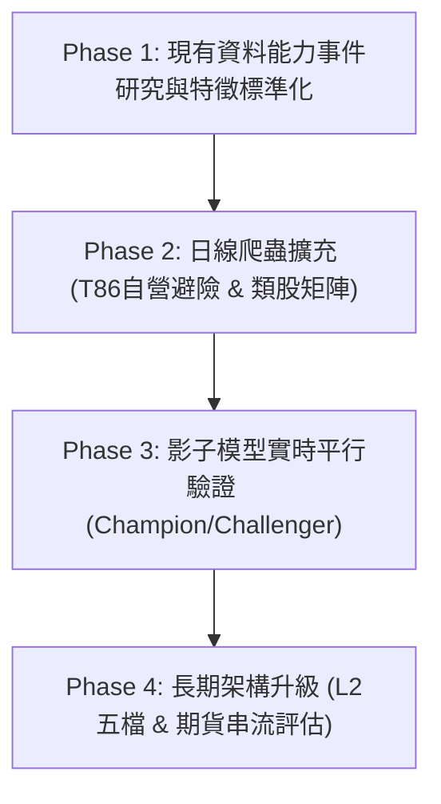

# EasyStock 當沖量化研究執行計畫 (Research Plan)

- **版本**：1.0 (基於 Knowledge V1 審計與現有架構對齊)
- **狀態**：研究規格規劃階段（本輪不進入實作、不修改代碼、不啟動回測）
- **核心防線**：
  1. **純模擬交易邊界**：所有研究與模型推論僅限於 Paper Trade，嚴禁呼叫券商真實下單 API。
  2. **生產環境隔離**：不修改目前 Production Baseline、不覆寫 `frozen-baseline.json`、不變更正式風控參數。
  3. **因果時鐘與無偏回測**：所有特徵計算嚴格遵守 $availability\_time \le decision\_time$；信號產生後進場必須包含保守延遲（次根 1 分 K 開盤價加上滑價）；標籤採用 Purge 與 Embargo 防止時間重疊資訊洩漏。
  4. **全成本扣除**：回測必須按 `paper_ledger.py` 相同口徑強制扣除券商手續費（28 折、低消 20 元）、現股當沖證交稅（0.15%）與滑價（至少 5-10 bps）。

---

## 1. 假說評估與優先級分級 (Hypothesis Prioritization)

依據 `repository_mapping.md` 與 `data_capability_matrix.yaml` 的資料支援度，將 Knowledge V1 候選規則劃分為三類：

### 第一優先級：現有資料能力即可研究 (Phase 1 Ready)
- **AQ_R_001 (多方標準型態日K突破前高)**：
  - 資料需求：日線 OHLCV、均線（5/10/20/60MA）、盤中 1 分 K 與 5 分 K。
  - 現狀：現有資料完全支援。
- **AQ_R_002 (多方連續型態跳空開高)**：
  - 資料需求：昨收價、今日開盤價、早盤成交量。
  - 現狀：現有資料完全支援。
- **AQ_R_003 (VWAP 均價線跌破停損與回測支撐)**：
  - 資料需求：5 分 K Typical Price VWAP、交易所官方平均價、逐筆 Tick。
  - 現狀：現有資料完全支援（現有 `strategy_engine.py` 與 `position_manager.py` 已有基礎實作）。
- **AQ_R_007A (盤中主動大單與內外盤買盤爆發)**：
  - 資料需求：`buy_ratio_60s`、`surge_60s`、`amount_60s`。
  - 現狀：現有資料完全支援（已在 `intraday_live.py` 連線運算）。排除無法驗證的 3 倍掛單牆，專注於「主動內外盤買量佔比」。
- **AQ_R_011 (部位分批與動態保本出場)**：
  - 資料需求：價格路徑、動態保本機制（+0.6% 觸發保本 +0.35%）。
  - 現狀：現有 `position_manager.py` 已實作，可進行參數網格研究。
- **AQ_R_012 (帳戶日內最大虧損停手風控)**：
  - 資料需求：`paper_ledger.py` 權益淨值與未實現損益狀態機。
  - 現狀：現有帳本機制完全支援。

### 第二優先級：需低成本爬蟲/日線擴充 (Phase 2 Dependent)
- **AQ_R_004 (自營商避險與權值股連動)**：
  - 阻斷原因：`update_market.py:parse_twse_t86` 丟棄自營商避險欄位。
  - 擴充方案：更新 T86 解析器，持久化「自營商避險買賣超股數/金額」，納入盤後日線特徵。
- **AQ_R_009 (族群帶量發動與連動跟進)**：
  - 阻斷原因：缺乏即時多檔股票同步計算類股指數與資金流向之矩陣引擎。
  - 擴充方案：建立盤中類股加權動能聚合器，先在 5 分 K 層級進行歷史回放。

### 第三優先級：受限於資料源，列入長期隔離 (Phase 3 Quarantined)
- **AQ_R_005 (台指期委買賣口數差與通道)**：缺乏期貨即時串流資料。
- **AQ_R_006 (樓層式當沖掛單分析)**：詹大樓層法依賴盤口厚度與密集價位掛單，無 L2 無法精確回測。
- **AQ_R_008 (前高拉回前低防守與大單轉折)**：涉及盤口深度牆判定，缺乏 L2。
- **AQ_R_010 (漲停打開回跌放空)**：現有系統不支援融券借券配額檢查與放空平盤限制回測，列入架構性隔離。

---

## 2. 階段實施時程與路線圖 (Implementation Roadmap)

### Phase 1: 現有資料能力事件研究 (Weeks 1 - 2)
1. **特徵標準化 (Feature Registry)**：
   - 將散落在 `strategy_engine.py` 與 `intraday_live.py` 的特徵統一成無偏函數接口（`upper_wick_ratio`, `bar_position`, `buy_ratio_60s`, `surge_60s`, `vwap_distance`）。
2. **事件樣本庫構建 (Event Dataset Building)**：
   - 提取歷史已歸檔交易日（2020-03 至 2026 年）的 1 分 K 棒與 Tick 記錄。
   - 標註急漲事件（5 分鐘漲幅 >= 2%）與 ORB 突破事件。
3. **無偏離線回測評估**：
   - 使用 `daytrade_learning/research.py:simulate` 引擎。
   - 固定進場延遲：信號後第 2 秒起算，次根 1 分 K Open 進場。
   - 固定出場規則：固定停損 (0.8%)、固定停利 (1.2%)、動態保本 (+0.6% 觸發保本 +0.35%)、12:55 強制平倉。
   - 輸出成本前後的勝率、平均淨報酬、Profit Factor、MFE/MAE 分布。

### Phase 2: 日線特徵擴充與族群連動 (Weeks 3 - 4)
1. **TWSE T86 自營商避險特徵接入**：
   - 擴充 `update_market.py` 中的 `parse_twse_t86`，補齊「自營商避險買賣超股數 (`dealer_hedging_shares`)」。
   - 生成 `F_dealer_hedging_share_ratio_eod` 特徵並建立歷史資料庫。
2. **類股動能聚合引擎 (Sector Momentum Aggregator)**：
   - 利用 `update_market.py` 中的 `category` 產業分類，在盤中/回測中彙整各類股成交金額加權漲跌幅。
   - 驗證領頭羊與跟隨股的 Lead-Lag 相關性假說。

### Phase 3: 離線模型訓練與影子平行運行 (Weeks 5 - 6)
1. **Logistic 回歸與機器學習候選模型訓練**：
   - 嚴格遵守 `daytrade_learning/champion.py` 的多折 Walk-forward 交叉驗證規範（至少 81 個交易日、500 個樣本）。
   - 特徵標準化（StandardScaler）與參數網格搜尋（`research_parameter_grids.yaml`）。
2. **影子模型平行評估 (Shadow Running)**：
   - 在 Paper Trade 運行期間，同時記錄 `frozen_baseline`、`rolling_model`、`radar_baseline` 與新候選模型之預測表現。
   - 連續追蹤至少 20 個交易日，Brier Score 必須顯著優於 Baseline 方可提報審查。

---

## 3. 無偏回測與評估協議 (Backtest Protocol)

### 3.1 樣本劃分 (Split Strategy)
- **訓練集 (In-Sample)**：歷史交易日前 70% 區間。
- **驗證集 (Validation)**：中間 15% 區間，用於超參數調優。
- **凍結測試集 (Frozen Out-of-Sample Holdout)**：最後 15% 區間，僅做最終檢驗，嚴禁調參。
- **Purge & Embargo**：若同一標的或同類股在日內 15 分鐘內觸發多個事件，採去重（Purging）與間隔封鎖（Embargo 30 分鐘），避免重疊標籤導致樣本非獨立性。

### 3.2 執行模擬與交易成本 (Execution & Costs)
- **進場價格**：次根 1 分 K $Open \times (1 + \text{Slippage})$（多方買進）。
- **出場價格**：觸發價或次根 1 分 K $Open \times (1 - \text{Slippage})$（賣出出場）。
- **滑價模型**：流動性充足標的（日均量 > 3,000 張）預設 5 bps；中型標的預設 10 bps。
- **交易稅與手續費**：
  $$\text{進場手續費} = \max(20, \text{成交金額} \times 0.001425 \times 0.28)$$
  $$\text{出場手續費} = \max(20, \text{成交金額} \times 0.001425 \times 0.28)$$
  $$\text{現股當沖證交稅} = \text{出場金額} \times 0.0015$$
- **漲跌停限制**：碰觸漲停板不可買進（買不進）；碰觸跌停板不可平倉（賣不掉，列入被鎖風險分析）。

### 3.3 評價指標 (Evaluation Metrics)
1. **Net Expectancy (淨期望值)**：每筆交易扣除所有成本後之平均淨報酬率（%）。
2. **Win Rate (勝率)**：淨報酬 > 0 之交易筆數佔比。
3. **Profit Factor (獲利因子)**：總獲利金額 / 總虧損金額。
4. **MFE / MAE 分布**：最大潛在獲利（Maximum Favorable Excursion）與最大逆向走勢（Maximum Adverse Excursion）之累積機率分佈，用以校準最佳停損停利點。
5. **Brier Score**：概率預測之均方誤差（校準度），越接近 0 越佳。

---

## 4. 實施邊界與安全警示

> [!CAUTION]
> 1. 本計畫所列所有研究參數與假說，均為待驗證研究規格，**不可視為生產環境之可交易策略**。
> 2. 嚴格遵守 EasyStock 純模擬帳戶邊界，禁止串接券商真實交易委託。
> 3. 模型晉升嚴格遵守 `daytrade_learning/champion.py` 的治理流程，禁止人為或自動無條件升級。
